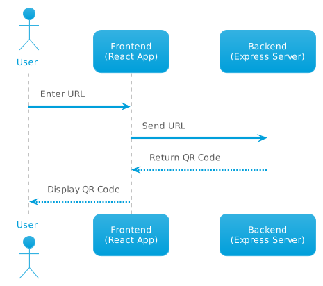

Sure, here's a detailed `README.md` file for your application:

---

# QR Code Generator

This is a simple QR Code Generator application built with React for the frontend and Node.js/Express for the backend.

# Participants

- Rakesh Budugu
- Subhasri Jothi
- Prasanna Avula

# What this brings to the table?
Here are some advantages of the current application compared to a previous solution:

- **Modern Tech Stack**: The application uses a modern tech stack including React for the frontend and Node.js/Express for the backend. This makes the application more maintainable and scalable compared to older technologies.

- **Customizable QR Codes**: The application allows for the embedding of a logo within the QR code, which can make the QR code more recognizable and branded.

- **Dynamic Logo Fetching**: The application can automatically fetch and use the logo from a website, making the process more dynamic and user-friendly.

- **Downloadable QR Codes**: Users can download the generated QR code directly from the application, which can be a convenient feature not present in all QR code generators.

- **Scalable Architecture**: The application is designed with a scalable architecture, allowing for potential future enhancements and features.

- **User-Friendly Interface**: The application has a simple and user-friendly interface, making it easy for users to generate QR codes.

- **CORS Enabled**: The application is CORS enabled, allowing it to accept requests from different origins, which can be useful in a microservices architecture or when the frontend and backend are hosted on different domains.

## Features

- Generate QR code from a URL
- Embed a logo in the QR code
- Download the generated QR code

## High Level Architecture



## Prerequisites

- Node.js
- npm

## Installation

### Backend

1. Navigate to the backend directory:

```bash
cd backend
```

2. Install the necessary packages:

```bash
npm install
```

3. Start the server:

```bash
node app.js
```

The server will start on port 3000.

### Frontend

1. Navigate to the frontend directory:

```bash
cd frontend
```

2. Install the necessary packages:

```bash
npm install
```

3. Start the React app:

```bash
npm start
```

The app will start on port 3001 (since 3000 port is used by express, after user confirmation).

## Usage

1. Open the app in your browser at `http://localhost:3001`.

2. Enter a URL in the text box.

3. Click the "Generate QR Code" button.

4. The QR code will be displayed below the button.

5. Click the "Download QR Code" link to download the QR code.

## Contributing

Pull requests are welcome. For major changes, please open an issue first to discuss what you would like to change.

## License

[MIT](https://choosealicense.com/licenses/mit/)

---

This `README.md` file provides a brief description of the application, lists the features, specifies the prerequisites, provides installation and usage instructions, and includes sections for contributing and the license. You should replace the placeholders with the actual paths to your backend and frontend directories, and update the other sections as necessary.
